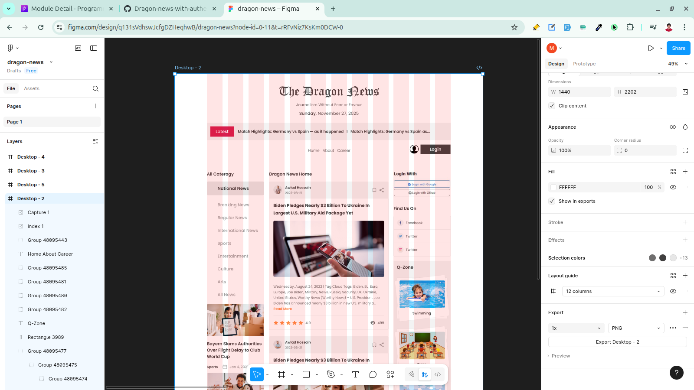

## Project Name: 

## What Problem I Solve By This Project: 

## Live Site Link: 

## Features:

## What I Learned New While Building This Project: 

1. how to implement just light theme: 

If you use daisyui by default our theme dark/light depend on the os default theme, if we want just a light theme we can use 

```html
<html data-theme="light">
```
or

```css
@plugin "daisyui" {
themes: light --default;
}
```

2. How to see figma design layout grid:  

- press to the left side: layers/Desktop-2
- press to the right side layout grid eye icon




3. How to use date-fns instead of raw js: 

```
import React from 'react';
import logo from '../../assets/logos/logo.png'

const Header = () => {

    const date = new Date();

    const formattedDate = date.toLocaleString('en-us', {
        weekday: 'long',
        month: 'long',
        day: 'numeric',
        year: 'numeric',
    })
    const convertedFormattedDate = (formattedDate.split(','))
    console.log(convertedFormattedDate.slice(1));
    return (
        <div className='text-center px-6 mt-4 md:mt-8 lg:mt-12'>
            
            <p className='mb-2.5 text-sm md:text-lg dark3'>Journalism Without Fear or Favour</p>
            <p className='font-medium text-sm md:text-xl dark3 '><span className='dark2'>{convertedFormattedDate[0]},</span>{convertedFormattedDate.splice(1).map((date, index) => <span key={index}>{date}</span>)}</p>
        </div>
    );
};

export default Header;
```

```jsx
import React from 'react';
import logo from '../../assets/logos/logo.png'
import { format } from 'date-fns';

const Header = () => {

    // const date = new Date();

    // const formattedDate = date.toLocaleString('en-us', {
    //     weekday: 'long',
    //     month: 'long',
    //     day: 'numeric',
    //     year: 'numeric',
    // })
    // const convertedFormattedDate = (formattedDate.split(','))

    return (
        <div className='text-center px-6 mt-4 md:mt-8 lg:mt-12'>
            
            <p className='mb-2.5 text-sm md:text-lg dark3'>Journalism Without Fear or Favour</p>
            {/* <p className='font-medium text-sm md:text-xl dark3 '><span className='dark2'>{convertedFormattedDate[0]},</span>{convertedFormattedDate.splice(1).map((date, index) => <span key={index}>{date}</span>)}</p> */}

            <p className='font-medium text-sm md:text-xl dark3'><span className='dark2'>{format(new Date(), "eeee, ")}</span>{format(new Date(), "MMMM dd, yyyy")}</p>
        </div>
    );
};

export default Header;
```

4. How to use react-fast-marquee

```jsx
import React, { use } from 'react';
import Marquee from "react-fast-marquee";
import { Link } from 'react-router';

const ShowMarquee = ({ fetchData }) => {
    const data = use(fetchData)

    const latestNews = data.filter((news) => news.others.is_today_pick === true)
    return (
        <Marquee pauseOnHover={true}>
            {latestNews.map((news) => <Link to={`/news-details/${news.id}`} className='mr-5 cursor-pointer hover:underline' key={news.id}>{news.title}</Link>)}
        </Marquee>
    );
};

export default ShowMarquee;
```

5. How to make a text-gradient: 

```jsx
<div>
    {details.length > 200 && <Link to={`/news-details/${id}`} className='font-medium bg-linear-to-r from-[#FF8C47] to-[#F75B5F] bg-clip-text text-transparent'>Read More</Link>}
</div>
```

6. How to iterate a map by just a number: 

```jsx
<div className='flex gap-2.5 items-center'>
    {[...Array(rating.number)].map((_, index) => <FaStar key={index} className='text-[#FF8C47]' size={24} />)}
    <p className='dark3 font-medium text-xl'>{rating.number}</p>
</div>
```

here, 
- Array(number) --> creates an array with a length of number but its elements are uninitialized. 
- [...Array(number)] --> the spread operator (...) turns that uninitialized elements into a real array with undefined values: [undefined, undefined, ...]
- map((_, index)) --> underscore _ is used here to show we don’t care about the value, we just need iterate.

7. How to make scrollbar

```jsx
<div className='grid grid-cols-12 gap-6 mt-20 min-h-[calc(100vh-576px)]'>
    {/* left side */}
    <div className='col-span-3 h-screen overflow-y-auto scrollbar sticky top-4'>
        <LeftSide></LeftSide>
    </div>
    {/* middle */}
    <div className='col-span-6'>
        <Outlet></Outlet>
    </div>
    {/* right side */}
    <div className='col-span-3 max-h-screen overflow-y-auto scrollbar sticky top-4'>
        <RightSide></RightSide>
    </div>
</div>
```

## What Challenges I Face While Building This Project:

1. To formate a ISO date to a CA English data formate: 

```jsx
 /*
    "author": {
      "name": "Shirin Akter",
      "published_date": "2025-04-22T17:00:00.000Z",
      "img": "https://randomuser.me/api/portraits/women/29.jpg"
    }, 
    */

    const date = new Date(author.published_date)
    console.log(date.toLocaleDateString()) // 4/23/2025
    console.log(date.toLocaleDateString('en-US')) // 4/23/2025
    console.log(date.toLocaleDateString('en-CA')) // 2025-04-23 (Canadian English locale)
```

## Contact With Me: 

tamim.muhammad2005@gmail.com | +8801586090360 (WhatsApp)  

https://www.linkedin.com/in/tamim-muhammad
 